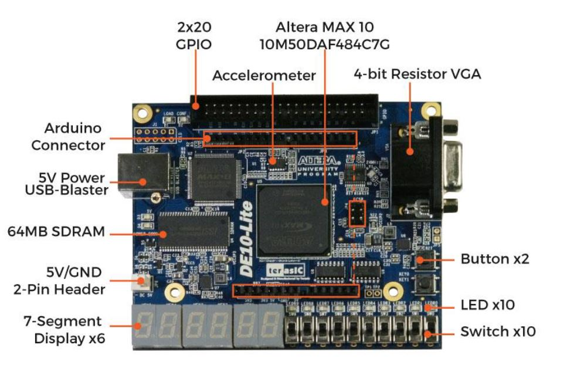

# Verilog Practices
The purpose of this repo is to store the Verilog practices done during the course **Programmable Logic Design** 2024. An Altera Max 10 10M50DAF484C7G FPGA was used to test the correct operation of the modules. To compile and upload the designs, the Quartus IDE, developed by Intel was recurrently used and the simulations were done in ModelSim Altera. 

Additionally, I included a brief paper where all the practices are presented along with their RTL views, test benches and physical testing. 

